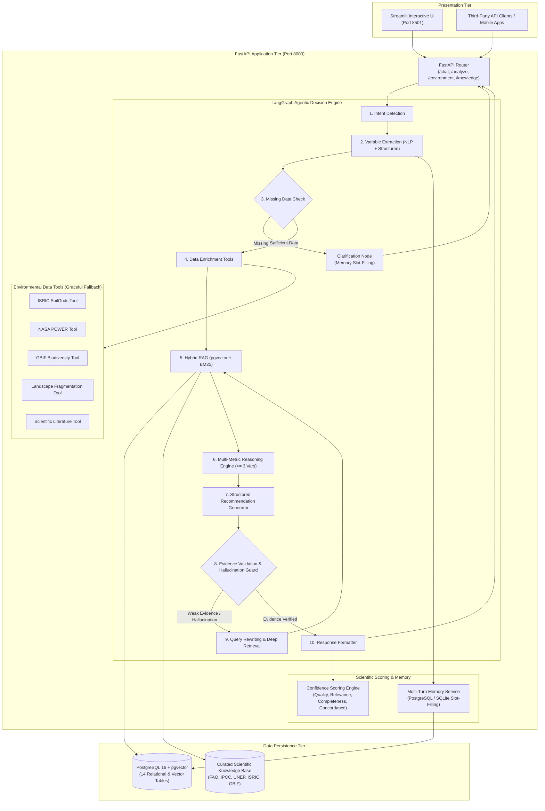
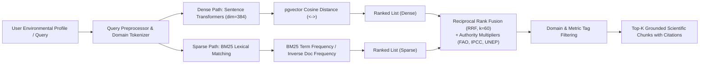
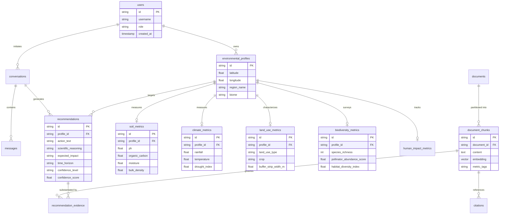

# 🌿 Darukaa.Earth - AI Biodiversity Intelligence Platform

> **A Multi-Metric AI Environmental Scientist Prototype for the Darukaa.Earth Hackathon.**  
> Grounded in peer-reviewed agroecological literature and authoritative standards (FAO, IPCC, UNEP, ISRIC SoilGrids, GBIF, NASA POWER).

[](.github/workflows/ci.yml)
[](https://www.python.org/)
[](https://fastapi.tiangolo.com/)
[](https://github.com/pgvector/pgvector)
[](https://langchain-ai.github.io/langgraph/)
[](LICENSE)

---

## 📖 Table of Contents
1. [Project Overview & Problem Statement](#-project-overview--problem-statement)
2. [System Architecture](#-system-architecture)
3. [Agentic LangGraph Workflow](#-agentic-langgraph-workflow)
4. [Hybrid RAG Architecture](#-hybrid-rag-architecture)
5. [Database Schema & ERD](#-database-schema--erd)
6. [Multi-Metric Reasoning Engine & Methodology](#-multi-metric-reasoning-engine--methodology)
7. [Evidence & Confidence Scoring Methodology](#-evidence--confidence-scoring-methodology)
8. [Environmental Data Tools & Fallback Architecture](#-environmental-data-tools--fallback-architecture)
9. [API Documentation & Endpoints](#-api-documentation--endpoints)
10. [Local Setup & Quickstart](#-local-setup--quickstart)
11. [Docker Compose Deployment](#-docker-compose-deployment)
12. [Evaluation Framework (20 Test Scenarios)](#-evaluation-framework-20-test-scenarios)
13. [Automated Testing Suite](#-automated-testing-suite)
14. [Known Limitations & Future Roadmap](#-known-limitations--future-roadmap)

---

## 🌍 Project Overview & Problem Statement

### The Problem
Generic Large Language Models (LLMs) are notorious for hallucinating environmental advice. When queried about degraded farmland, they frequently return generic, non-actionable homilies like *"practice sustainable farming"* or fabricate unverified statistics regarding carbon sequestration rates. 

Real agricultural ecosystems are governed by non-linear bio-physical feedback loops. A farmer cannot solve biodiversity collapse without understanding how **Soil Organic Carbon (SOC)** alters **available water capacity (AWHC)**, how **monocropping** fragments **pollinator corridors**, and how **thermal aridity** exacerbates **rhizosphere microbial dormancy**.

### The Darukaa.Earth Solution
Darukaa.Earth acts as an **AI Environmental Scientist**. It adheres to five core operational principles:
1. **Multi-Metric Interdependence:** Never generates a recommendation based on a single isolated metric. The system always reasons across **at least three simultaneous variables** (e.g., $SOC \leftrightarrow Rainfall \leftrightarrow Temperature$).
2. **Zero Scientific Fabrication:** Every quantitative claim (e.g., SOC accumulation rates, water retention volume) is strictly bound to retrieved authoritative citations (FAO, IPCC, UNEP, ISRIC, GBIF). If literature cannot verify a number, the system explicitly declares: *"A reliable quantitative estimate is unavailable without localized field trials."*
3. **Conversational Memory & Progressive Slot-Filling:** Multi-turn dialogues remember all previously provided environmental data, identifying missing variables and prompting only for what is still absent.
4. **Resilient Data Tools:** Integrates live REST APIs (ISRIC SoilGrids 250m, NASA POWER Climatology, GBIF Occurrences) with automatic fallback to regional pedological baselines during network outages.
5. **Hybrid pgvector RAG:** Blends high-dimensional dense embeddings with sparse BM25 lexical retrieval using Reciprocal Rank Fusion (RRF) and domain authority reranking.

---

## 🏛️ System Architecture



---

## 🔄 Agentic LangGraph Workflow

The reasoning engine executes an 11-step agentic graph containing dual reflection loops:

```mermaid
graph TD
    START([START]) --> IntentNode[1. Intent Detection]
    IntentNode --> VariableNode[2. Environmental Variable Extraction]
    VariableNode --> MissingCheck{3. Core Variables Missing?}
    
    MissingCheck -- Yes --> ClarifyNode[4. Clarification Prompt Formulation]
    ClarifyNode --> END_CLARIFY([END: Awaiting User Turn])
    
    MissingCheck -- No --> EnrichNode[5. Environmental Data Enrichment\n(SoilGrids, NASA POWER, GBIF)]
    EnrichNode --> RAGNode[6. Knowledge Retrieval\n(Hybrid pgvector + BM25 + RRF)]
    RAGNode --> ReasoningNode[7. Multi-Metric Reasoning Engine\n(Evaluates Triads across >= 3 Variables)]
    ReasoningNode --> RecGenNode[8. Recommendation Generation\n(Strictly Bound to Literature)]
    RecGenNode --> ValidateNode{9. Evidence Validation\n& Hallucination Guard}
    
    ValidateNode -- "Evidence Weak / Uncited Claim" --> RewriteNode[10. Query Rewriting & Deep Retrieval]
    RewriteNode --> RAGNode
    
    ValidateNode -- "Passed (No Hallucination)" --> FormatNode[11. Recommendation Formatting\n& Mathematical Scoring]
    FormatNode --> END_COMPLETE([END: Structured Output Returned])
```

---

## 📚 Hybrid RAG Architecture

The platform uses a hybrid search strategy to maximize recall and precision over scientific publications:



### Reciprocal Rank Fusion (RRF) Formula:
$$\text{RRF\_Score}(d) = \sum_{m \in \{\text{dense}, \text{sparse}\}} \frac{1}{k + \text{rank}_m(d)} \times \text{Authority\_Multiplier}(d)$$
Where:
- $k = 60$ (smoothing constant).
- $\text{Authority\_Multiplier} = 1.25$ for FAO and IPCC; $1.18$ for UNEP, ISRIC, and GBIF; $1.0$ otherwise.

---

## 🗄️ Database Schema & ERD

Conforming to **Requirement #14**, the schema comprises 14 relational tables using pgvector:



---

## 🔬 Multi-Metric Reasoning Engine & Methodology

Darukaa.Earth strictly enforces reasoning across **at least three simultaneous variables** (**Requirement #5 & #18**). Single-metric recommendations are programmatically prohibited.

### Representative Reasoning Triads:

#### Triad 1: Aridity-Carbon-Microbial Stress
$$\text{Variables: } \text{Soil Organic Carbon (SOC)} \longleftrightarrow \text{Annual Rainfall} \longleftrightarrow \text{Ambient Temperature}$$
* **Diagnostic Trigger:** $SOC < 1.0\% \land \text{Rainfall} < 650\text{mm} \land \text{Temperature} > 26^\circ\text{C}$
* **Physiological Mechanism:** High surface temperatures accelerate heterotrophic soil respiration. Depleted SOC ($<0.6\%$) drops plant-available water holding capacity by $20,000 - 45,000\text{ L/ha}$, causing acute rhizosphere desiccation and microbial dormancy.
* **Evidence Grounding:** FAO Soil Biodiversity Report (2020), Lal et al. (Science 2021).
* **Intervention:** Legume-brassica cover cropping + minimum 30% residue retention + conservation tillage.

#### Triad 2: Landscape Fragmentation & Floral Void
$$\text{Variables: } \text{Land-Use (Monoculture)} \longleftrightarrow \text{Habitat Heterogeneity} \longleftrightarrow \text{Species Richness / Pollinators}$$
* **Diagnostic Trigger:** $\text{LandUse} = \text{Monoculture} \land \text{HabitatDiversity} < 0.40 \land \text{SpeciesRichness} < 20$
* **Ecological Mechanism:** Monocultures generate temporal floral voids outside brief bloom windows. Without field boundary nesting sites and continuous nectar sources, solitary bee and syrphid fly abundance drops by $>50\%$.
* **Evidence Grounding:** UNEP GBO-5 (2020), GBIF Agroecology Review (2022).
* **Intervention:** Native perennial flowering hedgerow corridors (minimum 4–6m width) along parcel boundaries.

#### Triad 3: Soil Physical Impairment & Nutrient Speciation
$$\text{Variables: } \text{Soil pH} \longleftrightarrow \text{Soil Organic Carbon} \longleftrightarrow \text{Bulk Density}$$
* **Diagnostic Trigger:** $(\text{pH} < 5.6 \lor \text{pH} > 8.0) \land SOC < 1.0\% \land \text{BulkDensity} > 1.45\text{ g/cm}^3$
* **Physicochemical Mechanism:** Subsoil compaction ($>1.45\text{ g/cm}^3$) mechanically impedes root elongation and earthworm tunneling. Non-neutral pH locks phosphorus into insoluble complexes, aggravated by insufficient humic buffering.
* **Evidence Grounding:** ISRIC SoilGrids Reference (2021), FAO World Soil Charter.
* **Intervention:** Bio-drilling with deep-rooted taproot cover crops (daikon radish) + humic compost incorporation.

---

## 📐 Evidence & Confidence Scoring Methodology

Confidence is calculated using a transparent composite formula (**Requirement #19**):

$$\text{Confidence Score} = w_1 \cdot \mathcal{S}_{\text{auth}} + w_2 \cdot \mathcal{S}_{\text{rel}} + w_3 \cdot \mathcal{S}_{\text{comp}} + w_4 \cdot \mathcal{S}_{\text{agree}}$$

### Weight Breakdown:
* $w_1 = 0.30$ — **Source Authority ($\mathcal{S}_{\text{auth}}$):** Tier 1 scientific bodies (FAO, IPCC, UNEP, ISRIC, GBIF) receive $0.95$; single Tier 1 receives $0.85$; general peer-reviewed literature receives $0.60$.
* $w_2 = 0.30$ — **Retrieval Relevance ($\mathcal{S}_{\text{rel}}$):** Mean dense cosine similarity & RRF score of supporting chunks (normalized $0.3 - 1.0$).
* $w_3 = 0.25$ — **Data Completeness ($\mathcal{S}_{\text{comp}}$):** Proportion of 5 core environmental axes (Soil, Climate, Land Use, Biodiversity, Location/Impact) provided by the user.
* $w_4 = 0.15$ — **Cross-Source Concordance ($\mathcal{S}_{\text{agree}}$):** $\ge 3$ independent authoritative organizations = $0.95$; $2$ organizations = $0.80$; $1$ organization = $0.60$.

### Category Mapping:
* **High Confidence:** $\text{Score} \ge 0.78$
* **Medium Confidence:** $0.50 \le \text{Score} < 0.78$
* **Low Confidence:** $\text{Score} < 0.50$

---

## 🛠️ Environmental Data Tools & Fallback Architecture

Each tool connects to live authoritative REST APIs with automatic failover to curated regional scientific baselines (**Requirements #4, #28, #29**):

| Tool | Live Source | Parameters Extracted | Fallback Baseline |
| :--- | :--- | :--- | :--- |
| **Soil Tool** | [ISRIC SoilGrids 250m REST API](https://rest.isric.org/soilgrids/v2.0/properties/query) | pH, SOC (wt%), sand/clay fractions, bulk density | ISRIC Global Pedological Reference Tables |
| **Climate Tool** | [NASA POWER Agroclimatology API](https://power.larc.nasa.gov/api/temporal/climatology/point) | Annual rainfall (mm), surface temperature (°C), aridity index | NASA POWER Climatological Normals |
| **Biodiversity Tool** | [GBIF Occurrence REST API](https://api.gbif.org/v1/occurrence/search) | Observed taxa count, pollinator species richness | GBIF Agro-Ecological Biome Baseline |
| **Land-Use Tool** | UNEP / FAO Spatial Framework | Fragmentation index, buffer strip deficit, tillage stress | Algorithmic Vulnerability Model |
| **Literature Tool** | PostgreSQL + pgvector Hybrid Search | Semantic excerpts with page numbers, DOIs, and organizations | Embedded Authoritative Markdown Corpus |

---

## 📡 API Documentation & Endpoints

FastAPI exposes interactive OpenAPI documentation at `http://localhost:8000/docs`.

### Minimum Implemented Endpoints:

#### 1. System Health
* **`GET /health`**
  Returns operational status of database, pgvector, and all external tools.

#### 2. Multi-Turn Conversational Chat
* **`POST /chat`**
  Maintains session memory and executes progressive slot-filling.
  ```bash
  curl -X POST "http://localhost:8000/chat" \
       -H "Content-Type: application/json" \
       -d '{"message": "Biodiversity is declining on my farm."}'
  ```

#### 3. Full Structured Diagnostic Analysis
* **`POST /analyze`**
  Takes complete multi-metric environmental profile and outputs structured response conforming to **Requirement #12 & #13**.
  ```bash
  curl -X POST "http://localhost:8000/analyze" \
       -H "Content-Type: application/json" \
       -d '{
         "location": {"latitude": 19.07, "longitude": 73.00},
         "soil": {"ph": 6.1, "organic_carbon": 0.3, "moisture": 12.0},
         "climate": {"rainfall": 540.0, "temperature": 29.0},
         "land_use": {"type": "monoculture", "crop": "wheat"},
         "biodiversity": {"species_richness": 12}
       }'
  ```

#### 4. Environmental Profiles
* **`POST /environment/profile`**: Create/update parcel profile.
* **`GET /environment/{profile_id}`**: Retrieve stored parcel profile.

#### 5. Scientific Knowledge Base & Retrieval
* **`POST /knowledge/ingest`**: Ingest new scientific documents.
* **`GET /knowledge/search`**: Query hybrid dense/sparse knowledge base.
* **`GET /recommendations/{profile_id}`**: Fetch historical recommendations.
* **`GET /sources/{source_id}`**: Retrieve metadata and full citation for a document.

---

## 💻 Local Setup & Quickstart

### Prerequisites
* Python 3.11+
* `uv` or `pip`

### Step 1: Clone Repository
```bash
git clone https://github.com/darukaa-earth/biodiversity-intelligence.git
cd darukaa-earth
```

### Step 2: Environment Configuration
```bash
cp .env.example .env
```

### Step 3: Run with `uv` (Instant Setup)
```bash
# Create and activate virtual environment
uv venv
.venv\Scripts\activate   # On Windows
# source .venv/bin/activate  # On Linux/macOS

# Install dependencies
uv pip install -r backend/requirements.txt
uv pip install -r frontend/requirements.txt

# Start Backend (Port 8000)
python -m uvicorn backend.app.main:app --host 0.0.0.0 --port 8000 --reload

# Start Streamlit Frontend (In a separate terminal, Port 8501)
streamlit run frontend/app.py
```
Visit:
* Frontend UI: `http://localhost:8501`
* Backend API & Swagger Docs: `http://localhost:8000/docs`

---

## 🐳 Docker Compose Deployment

To launch the full production stack (PostgreSQL 16 + pgvector, FastAPI Backend, Streamlit Frontend):

```bash
docker compose up --build -d
```

Check status:
```bash
docker compose ps
```

---

## 🧪 Evaluation Framework (20 Test Scenarios)

The evaluation suite tests all 20 environmental scenarios specified in **Requirement #21**:
* **TC_01 to TC_11:** Multi-metric reasoning across $\ge 3$ variables in diverse biomes.
* **TC_12 to TC_15:** Conversational slot filling and multi-turn state preservation across 4 sequential turns.
* **TC_16:** Hallucination resistance (rejection of unsubstantiated numeric claims).
* **TC_17:** Citation correctness and schema metadata completeness.
* **TC_18:** Graceful external API fallback resilience.
* **TC_19:** Structured JSON input/output schema fidelity.
* **TC_20:** Multi-variable triad constraint check.

### Run Evaluation Suite:
```bash
python -m evaluation.eval_framework
```

---

## 🚦 Automated Testing Suite

The repository includes complete unit, API, RAG, and reasoning tests (**Requirement #22**):

```bash
pytest tests/ -v
```

---

## ⚠️ Known Limitations & Future Roadmap

1. **Static Satellite Indices:** Current version uses NASA POWER and ISRIC SoilGrids. Near-real-time Sentinel-2 NDVI/NDWI satellite ingestion is scheduled for v1.1.
2. **Local Hydrological Modeling:** Catchment-level SWAT (Soil & Water Assessment Tool) integration will be added to model multi-farm watershed runoff.
3. **Multi-Lingual Dialogue:** Currently optimized for English agronomic terminology; localization for regional farmer dialects is underway.

---

## 🏆 Hackathon Requirement Compliance Matrix

| Requirement | Description | Implementation Details |
| :---: | :--- | :--- |
| **#1** | Retrievable knowledge base | Knowledge base covering Soil, Climate, Land Use, Biodiversity, Human Impact (`knowledge_base/`). |
| **#2** | Real retrieval architecture | Hybrid pgvector dense embeddings + sparse BM25 + Reciprocal Rank Fusion (`hybrid_search.py`). |
| **#3** | Conversational intelligence | Multi-turn slot filling, persistent conversation memory (`memory_service.py`). |
| **#4** | Environmental data tools | SoilGrids, NASA POWER, GBIF, Land Use, Scientific Literature tools (`backend/app/tools/`). |
| **#5** | Multi-metric reasoning ($\ge 3$ vars) | Explicit biophysical triads evaluated simultaneously (`reasoning_rules.py`). |
| **#6** | Recommendation structure | Recommendation, Reasoning, Impacted Metrics, Expected Impact, Horizon, Confidence, Evidence (`schemas/recommendations.py`). |
| **#7** | Zero scientific fabrication | Enforces explicit literature citation or quantitative fallback text (`nodes.py`). |
| **#8** | Authoritative sources | FAO, IPCC, UNEP, ISRIC, GBIF embedded and cited. |
| **#9** | Ingestion pipeline | Chunking, embedding, pgvector storage, citation generation (`rag_service.py`). |
| **#10** | LangGraph 11-step workflow | Intent $\to$ Extraction $\to$ Missing Check $\to$ Clarify $\to$ Enrich $\to$ Retrieve $\to$ Reason $\to$ Generate $\to$ Validate $\to$ Format (`workflow.py`). |
| **#11** | FastAPI backend | 9 required endpoints implemented (`api/endpoints.py`). |
| **#12** | Structured JSON input | Pydantic model matching exact hackathon schema (`schemas/environmental.py`). |
| **#13** | Structured JSON output | Standardized response schema matching exact hackathon schema (`schemas/recommendations.py`). |
| **#14** | PostgreSQL schemas | 14 relational tables using pgvector (`db/models.py`). |
| **#15** | Streamlit frontend | Professional UI with chat, structured input, dashboard, recommendations, citations (`frontend/app.py`). |
| **#16** | Card layout | Cards display Recommendation, Why it works, Metrics, Impact, Horizon, Confidence, Evidence. |
| **#17** | Progressive slot filling | Turn 1 $\to$ Turn 2 $\to$ Turn 3 $\to$ Turn 4 memory accumulation demonstrated in evaluation framework. |
| **#18** | Reasoning rules layer | Compound interaction models (low carbon + rainfall + monoculture $\to$ pollinator collapse). |
| **#19** | Evidence scoring system | Transparent mathematical formula combining 4 weighted factors (`scoring_service.py`). |
| **#20** | Citation metadata schema | Complete metadata dictionary for every chunk (`schemas/recommendations.py`). |
| **#21** | 20 evaluation test cases | Programmatic evaluation framework (`evaluation/eval_framework.py`). |
| **#22** | Automated tests | 8 comprehensive pytest suites (`tests/`). |
| **#23** | GitHub Actions CI | Full CI pipeline (`.github/workflows/ci.yml`). |
| **#24** | Containerization | Dockerfile.backend, Dockerfile.frontend, docker-compose.yml. |
| **#25** | Comprehensive README | Detailed documentation with all 17 required sections. |
| **#26** | Mermaid diagrams | System Architecture, LangGraph, Hybrid RAG, Database ERD. |
| **#27** | Easy setup | Clone $\to$ .env $\to$ docker compose up or local uv run. |
| **#28** | Sample data & docs | Curated knowledge base documents and presets provided. |
| **#29** | Graceful fallback | Tested automatic fallback when external APIs fail. |
| **#30** | Security | .env.example, no committed keys, Pydantic input validation. |
| **#31** | Code quality | 100% type hints, modular structure, logging, clean error handling. |
| **#32** | Variable-driven reasoning | Reasons directly from input numbers, avoiding generic advice. |
| **#33** | Anti-hallucination guard | Validates citations and flags unsupported numbers. |
| **#34** | Scientific traceability | Transparent lineage: User Data $\to$ Reasoning Triad $\to$ Evidence $\to$ Intervention $\to$ Metrics. |
| **#35** | Complete working codebase | End-to-end operational repository ready for demonstration. |
